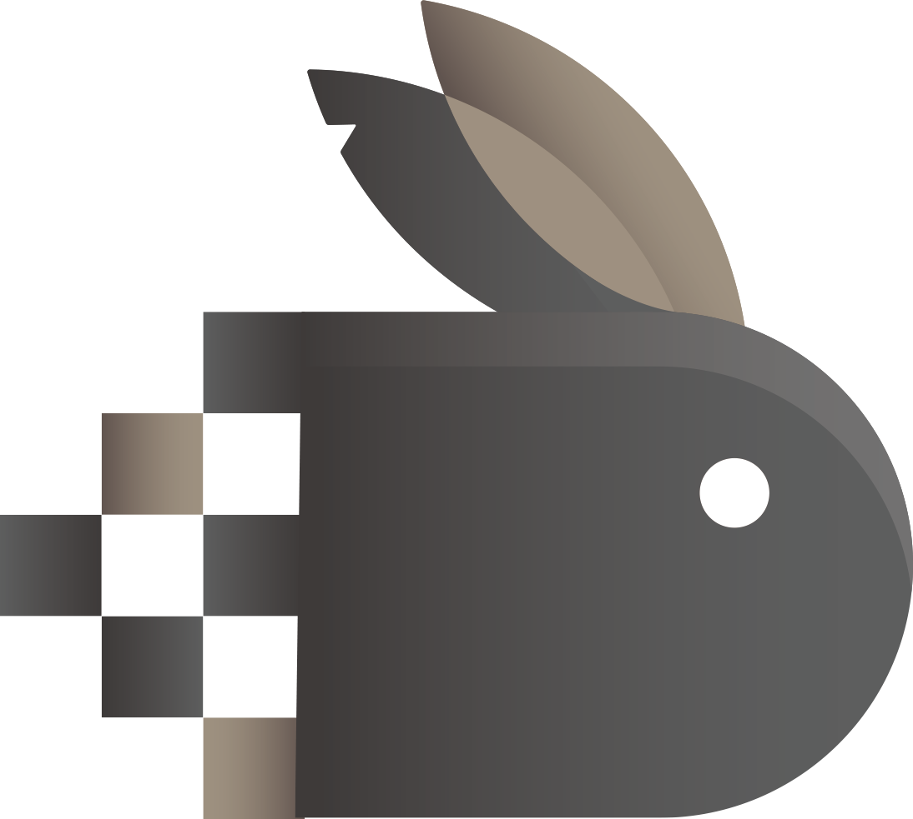

<p align="center"></p>

**<p align="center">🐇 An Authorization For Webman Plugin. 🐇</p>**

# <p align="center"> 🐇 Webman Authorization Plugin Base Casbin. 🐇</p>

[](https://github.com/php-casbin/webman-permission/actions/workflows/default.yml)
[](https://packagist.org/packages/casbin/webman-permission)
[](https://packagist.org/packages/casbin/webman-permission)
[](https://packagist.org/packages/casbin/webman-permission)

An authorization library that supports access control models like ACL, RBAC, ABAC for webman plugin

# Install

Composer Install
```sh
composer require -W casbin/webman-permission
```

# Use

## Dependency Injection configuration

Modify the `config/container.php` configuration to perform the following final contents:

```php
$builder = new \DI\ContainerBuilder();
$builder->addDefinitions(config('dependence', []));
$builder->useAutowiring(true);
return $builder->build();
```

## Database configuration

默认策略存储是使用的ThinkORM。

### 1、模型配置

默认使用ThinkORM。修改数据库 `thinkorm.php` 配置

> 如使用laravel数据库，配置参考如下
  - 修改数据库 `database.php` 配置
  - 修改数据库 `permission.php` 的`adapter`适配器为laravel适配器

### 2、创建 `casbin_rule` 数据表
```sql
CREATE TABLE `casbin_rule` (
	`id` BIGINT ( 20 ) UNSIGNED NOT NULL AUTO_INCREMENT,
	`ptype` VARCHAR ( 128 ) NOT NULL DEFAULT '',
	`v0` VARCHAR ( 128 ) NOT NULL DEFAULT '',
	`v1` VARCHAR ( 128 ) NOT NULL DEFAULT '',
	`v2` VARCHAR ( 128 ) NOT NULL DEFAULT '',
	`v3` VARCHAR ( 128 ) NOT NULL DEFAULT '',
	`v4` VARCHAR ( 128 ) NOT NULL DEFAULT '',
	`v5` VARCHAR ( 128 ) NOT NULL DEFAULT '',
	PRIMARY KEY ( `id` ) USING BTREE,
	KEY `idx_ptype` ( `ptype` ) USING BTREE,
	KEY `idx_v0` ( `v0` ) USING BTREE,
	KEY `idx_v1` ( `v1` ) USING BTREE,
	KEY `idx_v2` ( `v2` ) USING BTREE,
	KEY `idx_v3` ( `v3` ) USING BTREE,
	KEY `idx_v4` ( `v4` ) USING BTREE,
    KEY `idx_v5` ( `v5` ) USING BTREE 
) ENGINE = INNODB CHARSET = utf8mb4 COMMENT = '策略规则表';
```
### 3、配置 `config/redis` 配置

### 4、重启webman

```
php start.php restart
```
或者
```
php start.php restart -d
```

# 使用

安装成功后，可以这样使用:

```php
use Casbin\WebmanPermission\Permission;

// adds permissions to a user
Permission::addPermissionForUser('eve', 'articles', 'read');
// adds a role for a user.
Permission::addRoleForUser('eve', 'writer');
// adds permissions to a rule
Permission::addPolicy('writer', 'articles','edit');
```

你可以检查一个用户是否拥有某个权限:

```php
if (\Casbin\WebmanPermission\Permission::enforce('eve', 'articles', 'edit')) {
    echo '恭喜你！通过权限认证';
} else {
    echo '对不起，您没有该资源访问权限';
}
```

# 多套驱动配置

```php
$permission = \Casbin\WebmanPermission\Permission::driver('restful_conf');
// adds permissions to a user
$permission->addPermissionForUser('eve', 'articles', 'read');
// adds a role for a user.
$permission->addRoleForUser('eve', 'writer');
// adds permissions to a rule
$permission->addPolicy('writer', 'articles','edit');

if ($permission->enforce('eve', 'articles', 'edit')) {
    echo '恭喜你！通过权限认证';
} else {
    echo '对不起，您没有该资源访问权限';
}
```

更多 `API` 参考 [Casbin API](https://casbin.org/docs/en/management-api) 。

# 教程
* [Casbin权限实战：入门分享(中文)](https://www.bilibili.com/video/BV1A541187M4/?vd_source=a9321be9ed112f8d6fdc8ee87640be1b)
* [Casbin权限实战：基于角色的RBAC授权](https://www.bilibili.com/video/BV1A541187M4/?vd_source=a9321be9ed112f8d6fdc8ee87640be1b)
* [Casbin权限实战：RESTful及中间件使用](https://www.bilibili.com/video/BV1uk4y117up/?vd_source=a9321be9ed112f8d6fdc8ee87640be1b)
* [Casbin权限实战：如何使用自定义匹配函数](https://www.bilibili.com/video/BV1dq4y1Z78g/?vd_source=a9321be9ed112f8d6fdc8ee87640be1b)
* [Webman实战教程：如何使用casbin权限控制](https://www.bilibili.com/video/BV1X34y1Q7ZH/?vd_source=a9321be9ed112f8d6fdc8ee87640be1b)

# 测试

## 测试套件

本项目包含完整的单元测试套件，覆盖了以下方面：

### 测试文件结构

```
tests/
├── Adapter.php                    # 适配器基础测试
├── PermissionTest.php            # Permission类测试
├── AdapterTest.php                # 适配器详细测试
├── EdgeCaseTest.php              # 边界情况测试
├── IntegrationTest.php            # 集成测试
├── LaravelDatabase/
│   ├── LaravelDatabaseAdapterTest.php
│   └── TestCase.php
├── ThinkphpDatabase/
│   ├── DatabaseAdapterTest.php
│   └── TestCase.php
└── config/
    └── plugin/
        └── casbin/
            └── webman-permission/
                └── permission.php
```

### 测试覆盖范围

1. **基础功能测试**
   - 权限添加、删除、检查
   - 角色分配、移除
   - 策略管理

2. **适配器测试**
   - 数据库操作
   - 过滤器功能
   - 批量操作
   - 事务处理

3. **边界情况测试**
   - 空值处理
   - 特殊字符
   - 大数据量
   - 性能测试

4. **集成测试**
   - RBAC完整流程
   - 域权限控制
   - 多驱动支持
   - 复杂业务场景

5. **错误处理测试**
   - 异常情况
   - 无效输入
   - 并发访问

### 运行测试

```bash
# 运行所有测试
php vendor/bin/phpunit tests/

# 运行特定测试文件
php vendor/bin/phpunit tests/PermissionTest.php

# 运行特定测试方法
php vendor/bin/phpunit --filter testAddPermissionForUser tests/PermissionTest.php

# 生成测试覆盖率报告
php vendor/bin/phpunit --coverage-html coverage tests/
```

### 测试要求

- PHP >= 8.1
- PHPUnit >= 9.0
- 数据库连接
- Redis连接

### 测试环境配置

测试环境会自动创建以下数据表：
- `casbin_rule` - 默认策略表
- `other_casbin_rule` - 其他驱动策略表

### 测试最佳实践

1. **编写新测试**
   - 继承适当的测试基类
   - 遵循命名约定
   - 添加必要的断言

2. **测试数据管理**
   - 使用 `setUp()` 和 `tearDown()` 方法
   - 确保测试数据隔离
   - 清理测试数据

3. **测试覆盖**
   - 覆盖正常流程
   - 测试异常情况
   - 验证边界条件

## 贡献指南

### 添加新功能测试

1. 为新功能编写对应的测试用例
2. 确保测试覆盖率达到要求
3. 运行完整测试套件
4. 提交代码前检查测试状态

### 修复Bug测试

1. 为Bug编写重现测试
2. 修复Bug后验证测试通过
3. 确保不影响现有功能

# 感谢

[Casbin](https://github.com/php-casbin/php-casbin)，你可以查看全部文档在其 [官网](https://casbin.org/) 上。

<details>
	
<summary> 解除 https://github.com/PHP-DI/PHP-DI依赖的解决方案（不推荐）</summary>

1、卸载DI依赖包：`composer remove php-di/php-di`

2、修改：`Casbin\WebmanPermission\Permission` 文件

```php
if (is_null(static::$_manager)) {
    static::$_manager = new Enforcer($model, Container::get($config['adapter']),false);
}
```
替换为
```php
if (is_null(static::$_manager)) {
    if ($config['adapter'] == DatabaseAdapter::class) {
        $_model = new RuleModel();
    } elseif ($config['adapter'] == LaravelDatabaseAdapter::class) {
        $_model = new LaravelRuleModel();
    }
    static::$_manager = new Enforcer($model,  new $config['adapter']($_model), false);
}
```
耦合太高，不建议这么搞，更多了解：https://www.workerman.net/doc/webman/di.html
</details>

## 问题

* Laravel的驱动报错：`Call to a member function connection() on null|webman2.1/vendor/illuminate/database/Eloquent/Model.
  php|1918`。解决方案，请检查本地数据库代理是否正常，如使用了Docker容器主机地址`dnmp-mysql`可能会导致该问题出现。 
